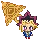

# Projeto Yu-Gi-Oh Jan Ken Po :rock: :page_facing_up: :scissors:  

Este projeto foi baseado no repositório DIO Potência Tech.
Construído com HTML, CSS e Javascript puros, algumas alterações foram feitas visando maior adaptabilidade:
- CSS responsivo.
- Adição de um botão de start para habilitar a execução dos áudios e iniciar jogo[^1].

[Clique aqui](https://rklabtest.github.io/Projeto_Yu-Gi-Oh_Jankenpo/) para visualizar o projeto.

## Sobre o jogo

O projeto traz o clássico jogo "Pedra, Papel e Tesoura" (Jan Ken Po) com uma roupagem do famoso anime Yu-Gi-Oh. Nele, você irá desafiar o computador para uma batalha na qual a sorte é a maior aliada.

O jogo possui três cartas que representam tipos distintos (paper=papel, scissors=tesoura ou rock=pedra) e cada jogador recebe 5 cartas aleatórias contendo uma ou mais cartas destes tipos:

- Blue Eyes White Dragon - paper
- Dark Magician - Rock
- Exodia - Scissors

Cada vitória ou derrota é contabilizado no painel de score. Ganha quem sobrepor os elementos mais vezes, conforme as regras do Jan Ken Po tradicional.

## Controles:

 - **No computador**: para visualizar as prévias das cartas recebidas, você deve passar o mouse sobre o set de cartas. Para lançar a carta no jogo, é necessário dar um clique duplo sobre a carta desejada.

 - **No celular**: para visualizar as prévias das cartas recebidas, você deve tocar uma vez sobre a carta que deseja visualizar. Para lançar a carta, você precisa dar duplo toque sobre a carta escolhida.

[^1]: Os navegadores possuem um mecanismo para impedir a execução automática de áudios, sendo necessária a interação do usuário com a aplicação para que estes sejam habilitados.
